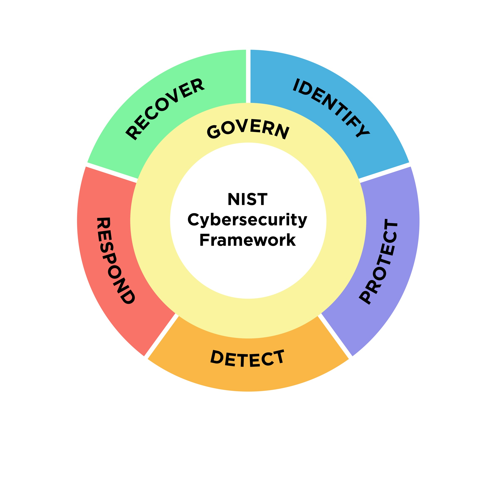
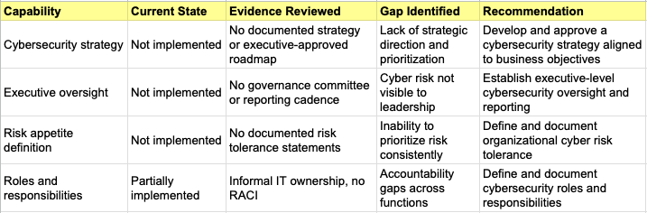
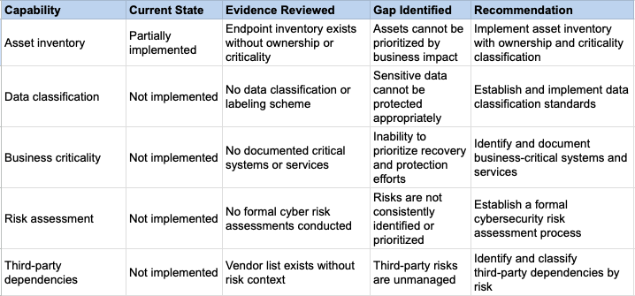
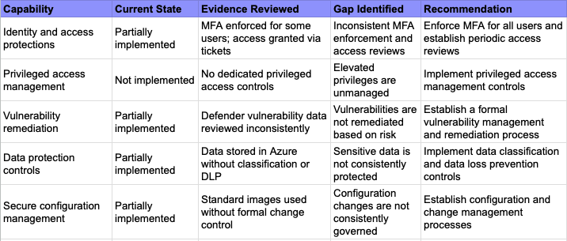
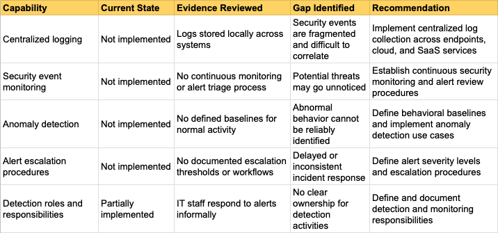
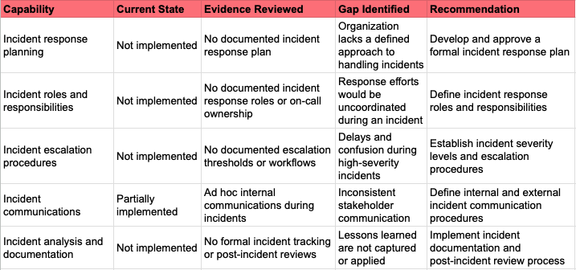
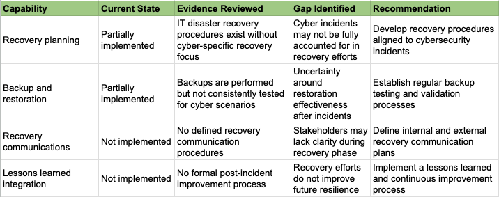

# NIST CSF 2.0 Gap Assessment

## Executive Summary

This assessment evaluated the organization’s current cybersecurity posture using the NIST Cybersecurity Framework (CSF) 2.0. The objective was to identify gaps in governance, risk management, and technical controls, and to develop a prioritized roadmap to improve cybersecurity maturity.

Overall, the organization’s cybersecurity maturity aligns with **NIST CSF Tier 1: Partial**. While several security tools and practices are in place, they are inconsistently implemented and lack formal governance, risk-based prioritization, and executive oversight.

### Key Findings
- Cybersecurity governance and executive oversight are not formally established
- Asset, data, and risk visibility are incomplete, limiting effective prioritization
- Preventive security controls exist but are inconsistently enforced
- Detection, response, and recovery capabilities are largely informal or undocumented
- Third-party cybersecurity risk is unmanaged

### Top Cybersecurity Risks
- Increased likelihood of account compromise due to inconsistent MFA enforcement
- Delayed detection of security incidents due to lack of centralized monitoring
- Extended recovery time due to absence of formal incident response and recovery processes
- Exposure to third-party risk without standardized vendor assessments
- Inability to prioritize remediation efforts due to undefined risk tolerance

### Recommended Path Forward
The organization should prioritize establishing foundational governance and risk management capabilities and target progression to **NIST CSF Tier 2: Risk-Informed**. This includes defining cybersecurity ownership, formalizing risk assessment processes, enforcing baseline security controls, and improving visibility through centralized monitoring.

A phased improvement roadmap has been developed to guide this progression while balancing security improvements with operational practicality.

## Company Profile

**Organization Type:** B2B SaaS company  
**Employee Count:** Approximately 100  
**Industry:** Cloud-native software services  
**Customer Base:** Small to mid-sized businesses  
**Regulatory Exposure:** Moderate  

The organization processes customer data and relies heavily on service availability to meet contractual and operational obligations. While not operating in a highly regulated industry, the company must maintain reasonable controls to ensure confidentiality, integrity, and availability of systems and data.

### Technology Environment

- **Identity and Email:** Microsoft 365 or Google Workspace
- **Cloud Provider:** Microsoft Azure
- **Endpoint Operating System:** Windows laptops
- **Endpoint Security:** Microsoft Defender for Endpoint
- **Password Management:** LastPass
- **Architecture:** SaaS-first with minimal on-premises infrastructure

## Assessment Objective

The purpose of this assessment is to evaluate the organization’s current cybersecurity posture using the NIST Cybersecurity Framework 2.0, identify gaps across governance, risk management, and technical controls, and develop a prioritized roadmap to improve cyber risk management maturity.

## Scope and Assumptions

### In Scope
- Corporate IT environment
- Cloud infrastructure hosted in Microsoft Azure
- SaaS applications supporting core business functions
- End-user endpoints
- Identity and access management
- Third-party SaaS vendors

### Out of Scope
- Secure software development lifecycle
- Application penetration testing
- Customer-managed environments

### Key Assumptions
- No formal cybersecurity governance program exists
- Cybersecurity responsibilities are primarily handled by IT operations
- Existing security tooling is inconsistently used
## Current Cybersecurity Posture Summary

The following summary reflects the organization’s current cybersecurity capabilities based on interviews, documentation review, and high-level technical observations.

### Governance

- No formally documented cybersecurity strategy approved by executive leadership
- Cybersecurity responsibilities embedded within IT operations
- No defined executive or board-level oversight of cybersecurity risk

### Asset Management

- Endpoints are deployed using standardized corporate images
- Asset inventory exists but does not include ownership or business criticality
- Cloud resources are tracked at a high level but not risk-ranked

### Identity and Access Management

- Centralized identity management using Entra ID (Azure AD)
- Multi-factor authentication enforced for some users, not universally
- No privileged access management solution in place
- Access is granted through ticket-based requests
- Periodic access reviews are informal or ad hoc

### Vulnerability Management

- Microsoft Defender provides vulnerability visibility
- No documented vulnerability management policy
- Vulnerability remediation is reactive and inconsistently prioritized
- No defined service-level objectives for patching

### Logging and Monitoring

- Endpoint alerts monitored through Microsoft Defender
- No centralized security information and event management solution
- Limited visibility into cloud and SaaS activity logs

### Incident Response

- No formal incident response plan
- Incidents are handled reactively by IT staff
- No incident tabletop exercises or post-incident reviews

### Third-Party Risk Management

- Extensive use of third-party SaaS vendors
- No formal third-party risk management process
- Vendor security reviews are not standardized or documented

## NIST CSF 2.0 Gap Assessment Results

The NIST Cybersecurity Framework 2.0 was used as a structured lens to evaluate the organization’s cybersecurity capabilities across six core functions.

 

 <h3> See Results</h3> 

### 
**Assessment Result:** Largely Not Implemented 

### 
**Assessment Result:** Partially Implemented

### 
**Assessment Result:** Partially Implemented

### 
**Assessment Result:** Not Implemented

### 
**Assessment Result:** Not Implemented

### 
**Assessment Result:** Partially Implemented

 

## Key Cybersecurity Risks

- Inconsistent MFA enforcement increases the likelihood of account compromise
- Lack of centralized logging limits the organization’s ability to detect and investigate security events
- Absence of a formal incident response plan increases operational and recovery risk
- Unmanaged third-party risk exposes customer data and service availability
- Undefined vulnerability remediation timelines increase exposure to known exploits

## CSF Tier Assessment

Based on the findings of this assessment, the organization’s current cybersecurity maturity aligns with **NIST CSF Tier 1: Partial**.

At this tier, cybersecurity risk management activities are largely reactive, inconsistently implemented, and primarily driven by operational IT needs rather than formal governance or risk-based decision making. While some security controls and tools are in place, they are not consistently governed, measured, or aligned to defined risk tolerance.

### Current Tier: Tier 1 – Partial

Characteristics observed:
- Cybersecurity governance is informal and lacks executive oversight
- Risk management processes are not formally established
- Security activities are reactive rather than proactive
- Policies, procedures, and roles are incomplete or undocumented

### Target Tier: Tier 2 – Risk-Informed

The recommended target state for the organization is **NIST CSF Tier 2: Risk-Informed**.

At this tier, cybersecurity risk management practices are formally established, leadership is aware of cybersecurity risks, and risk-based prioritization begins to inform decision making. This target tier represents a realistic and achievable maturity improvement for a mid-sized SaaS organization without overextending resources or creating unnecessary operational burden.

Target Tier 2 objectives include:
- Defined cybersecurity governance and ownership
- Documented risk assessment and risk management processes
- Consistent application of baseline security controls
- Leadership visibility into cybersecurity risk and priorities

A longer-term progression toward **Tier 3: Repeatable** may be considered after Tier 2 capabilities are established and operating effectively.

## Improvement Roadmap

### Phase 1: Foundation (0–90 Days)
- Establish cybersecurity governance and ownership
- Enforce MFA for all users
- Define a vulnerability management process
- Draft core cybersecurity policies

### Phase 2: Maturity (3–6 Months)
- Implement centralized logging and monitoring
- Formalize incident response procedures
- Conduct access reviews
- Introduce third-party risk assessments

### Phase 3: Optimization (6–12 Months)
- Mature detection and response capabilities
- Perform incident response tabletop exercises
- Align key controls to NIST 800-53
- Establish continuous risk monitoring

## Appendix: Evidence Request Checklist

The following evidence would typically be reviewed to validate assessment findings:
- Cybersecurity policies and standards
- Risk assessment and risk register documentation
- Asset and data inventories
- Access control and MFA configurations
- Vulnerability management reports
- Logging and monitoring dashboards
- Incident response and recovery documentation
- Third-party vendor security assessments
